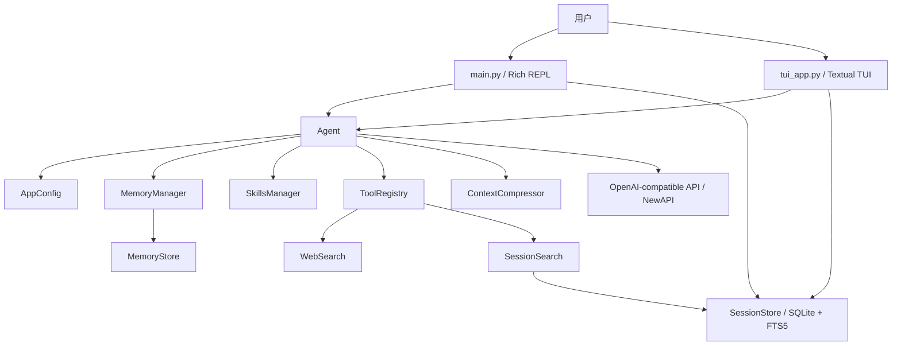
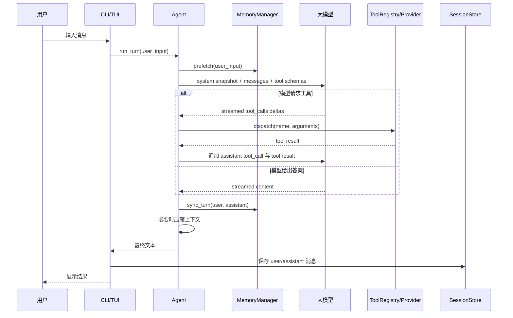

# My Learning Agent 项目学习与演进指南

> 基于 2026-07-13 的代码状态编写。本文以源码的真实行为为准；当 README、注释与实现不一致时，会明确指出差异。

## 1. 先建立整体认识

My Learning Agent 是一个本地运行、兼容 OpenAI Chat Completions API 的对话 Agent。它不只把用户消息发给模型，还在模型外面增加了五类能力：

1. **工具循环**：模型可以连续调用记忆、技能、历史搜索和联网搜索工具。
2. **持久记忆**：重要事实写入 `MEMORY.md`，用户偏好写入 `USER.md`。
3. **技能学习**：把可复用流程写成带 YAML frontmatter 的 `SKILL.md`。
4. **会话存储**：使用 SQLite 保存消息，并通过 FTS5 做全文检索。
5. **上下文治理**：记录 token 用量，在上下文过长时压缩中间消息。

项目有两个用户入口：

- `main.py`：Rich 命令行 REPL，逻辑直接、适合先学习。
- `tui_app.py`：Textual 双栏 TUI，增加后台 Worker、流式区域、会话列表和技能列表。

建议先读 CLI，再读 TUI。TUI 复用了同一套核心对象，但 UI 并发会增加理解成本。

## 2. 架构全景



代码按责任可以分成六层：

| 层 | 主要文件 | 责任 |
|---|---|---|
| 交互与入口 | `main.py`, `tui_app.py` | 组装对象、接收输入、展示输出、处理 slash command |
| Agent 核心 | `agent/` | 模型循环、配置、记忆抽象、压缩、会话存储、策展 |
| 工具与能力 | `tools/` | 工具注册、记忆实现、技能管理、历史检索、联网检索 |
| 插件扩展 | `plugins/` | 为外部记忆 Provider 等扩展预留命名空间 |
| 测试 | `tests/` | 隔离模型和网络，验证核心行为 |
| 项目支持 | `README.md`, `config.yaml`, `pyproject.toml` | 使用说明、运行配置、依赖和工具配置 |

最关键的依赖方向是：**入口依赖 Agent，Agent 依赖抽象和工具注册表，具体工具依赖本地存储或外部 API**。核心层不应该反向依赖 TUI。

## 3. 一次对话是怎样跑完的



这里有一个重要边界：`Agent` 管理**当前进程内的完整消息历史**，`SessionStore` 保存**跨进程可检索的用户和助手文本**。当前实现没有把 tool call 的完整 JSON 写入数据库，因此数据库记录不是运行时消息列表的无损副本。

## 4. 推荐学习路线

### 第 1 步：运行和观察

```powershell
uv run .\main.py
uv run .\main.py --tui
uv run pytest -q
```

先体验 `/skills`、`/search`、`/curator` 和 `/learn <主题>`。学习代码时要不断问三个问题：谁创建对象、谁保存状态、谁负责失败降级。

### 第 2 步：从 `main.py` 看依赖组装

`main()` 采用手工依赖注入：先创建 `SessionStore`、`MemoryStore`、`MemoryManager`、`SkillsManager`、`SessionSearch` 和 `Curator`，再把它们挂到 `Agent`。

简化后的结构如下：

```python
config = load_config()
store = SessionStore(config.storage.db_path)

memory_manager = MemoryManager()
memory_manager.add_provider(MemoryStore(data_dir=config.memory.data_dir))
memory_manager.initialize(session_id)

agent = Agent(config)
agent.memory_manager = memory_manager
agent.skill_manager = SkillsManager(config.skills.skills_dir)
agent.session_search = SessionSearch(store.db)
agent.build_system_prompt()
```

为什么手工组装：项目规模较小时，它比引入依赖注入框架更透明，测试也能直接替换字段。代价是 `main.py` 与 `tui_app.py` 重复了大量装配代码，后续应提取统一的应用工厂。

### 第 3 步：阅读 `Agent.run_turn()` 和 `_call_llm_loop()`

这是整个项目的心脏。`run_turn()` 管理一轮的前后生命周期，`_call_llm_loop()` 管理一轮内可能发生多次的“模型 → 工具 → 模型”。

流式工具调用不能把每个 chunk 当成完整调用。API 可能把函数名和 JSON 参数拆成多个 delta，所以代码用 `index` 找到槽位并累加：

```python
slot = tool_call_slots[tc_delta.index]
if tc_delta.id:
    slot["id"] = tc_delta.id
if tc_delta.function.name:
    slot["function"]["name"] += tc_delta.function.name
if tc_delta.function.arguments:
    slot["function"]["arguments"] += tc_delta.function.arguments
```

为什么必须保存 assistant 的 `tool_calls` 消息：OpenAI 协议要求工具结果通过 `tool_call_id` 与前一条 assistant 请求配对。只保存 tool result 而省略请求消息，会导致下一次模型调用被 API 拒绝或丢失语义。

当前边界：

- 工具循环没有最大步数，异常模型可能无限调用工具。
- 多个工具在注释里称为“并行”，实际代码按顺序执行。
- JSON 参数解析失败后使用空字典继续，可能把参数错误掩盖成工具内部错误。
- 未对工具进行只读、可并行、有副作用等能力分类。

### 第 4 步：理解冻结 System Prompt

`Agent.build_system_prompt()` 把基础能力说明、记忆快照和技能摘要拼起来，并保存到 `_system_prompt_snapshot`。后续每次调用都复用同一个前缀。

这样写有两个原因：

1. 相同前缀更容易命中模型服务的 prefix cache，降低延迟和费用。
2. 会话中途写入的新记忆不会突然改变系统指令，减少模型行为漂移。

代价是新记忆只能在下一次会话自动进入 System Prompt。当前会话如果需要读取刚写入的内容，模型必须调用 `memory_read`。

### 第 5 步：理解 Provider 抽象

`MemoryProvider` 是抽象基类，定义了记忆后端的生命周期：

```python
class MemoryProvider(ABC):
    @property
    @abstractmethod
    def name(self) -> str: ...

    @abstractmethod
    def initialize(self, session_id: str, **kwargs) -> None: ...

    @abstractmethod
    def system_prompt_block(self) -> str: ...

    def get_tool_schemas(self) -> list[dict[str, Any]]:
        return []
```

`MemoryManager` 负责广播生命周期和建立 `tool_name → provider` 路由。这样 `Agent` 不需要知道记忆来自 Markdown、Redis 还是向量数据库。

为什么为每个 Provider 捕获异常：记忆是增强能力，不应该因为一个外部 Provider 暂时不可用就让整个聊天退出。这里选择的是“隔离失败、记录日志、继续服务”。

当前 `prefetch()` 返回 `None`，`MemoryManager.prefetch()` 也丢弃返回值，因此“按当前问题召回相关记忆”还只是扩展点，没有真正注入模型上下文。

### 第 6 步：深入 `MemoryStore`

`MemoryStore` 管理两个文件：

- `MEMORY.md`：Agent 的经验、项目事实和决策。
- `USER.md`：用户偏好、环境和个性化信息。

多行条目用 `\n§\n` 分隔，而不是逐行存储，因为一条记忆本身可能包含多行。

写入流程是：清理空白 → 威胁关键词扫描 → 追加条目 → FIFO 驱逐 → 持久化。持久化前比较 MD5，试图避免覆盖其他进程对 `MEMORY.md` 的修改。

为什么使用字符上限而不是 token 上限：不同模型的 tokenizer 不同，字符数便于保持后端无关和实现简单。它不是精确预算；中文、英文和代码的 token/字符比例不同。

当前边界：

- 漂移检测只在写入前检查 `MEMORY.md`，没有对 `USER.md` 做同等检查。
- 单条记忆本身超过上限时，因为驱逐循环要求至少两条记录，它仍会超限。
- 威胁扫描只是关键词匹配，不能替代内容来源标记、结构化权限和人工确认。
- 写两个文件不是事务操作，中途失败可能只更新其中一个。

### 第 7 步：理解工具自动发现和注册

导入 `tools` 包时，`discover_builtin_tools()` 扫描模块 AST，只导入含顶层 `registry.register(...)` 的模块。模块导入后执行自注册，最终由全局 `ToolRegistry` 保存 schema 和 handler。

为什么先做 AST 扫描：如果无差别导入 `tools/` 下所有 Python 文件，辅助模块也会执行顶层副作用，启动更慢且更难排错。AST 检查把“是否是工具模块”变成一个便宜的静态判断。

`registry.dispatch()` 统一捕获异常，并把非字符串结果转成 JSON：

```python
result = entry.handler(**args, **kwargs)
if isinstance(result, str):
    return result
return json.dumps(result, ensure_ascii=False)
```

当前注册策略是“同名覆盖”。这让热替换很方便，但也会掩盖重复注册。`tools/skills_tool.py` 当前正存在两段重复注册，后半段覆盖了前半段的正确 handler，并调用不存在的 `SkillsManager.handle_tool_call()`。

### 第 8 步：理解技能系统和策展器

一个技能是磁盘上的 `SKILL.md`：

```yaml
---
name: python-retry
description: 编写可配置的 Python 重试逻辑
version: 1
created_by: agent
metadata:
  use_count: 0
  last_used: null
  state: active
  pinned: false
---
```

`SkillsManager` 采用渐进式加载：System Prompt 只包含名称与描述，模型判断相关后再调用 `skill_view` 加载全文。这可以让技能数量增长时，固定前缀仍保持可控。

缓存签名由每个 `SKILL.md` 的路径和 mtime 组成。签名没变就复用元数据缓存；签名变化才重新解析全部 frontmatter。这是典型的“用便宜元数据避免昂贵内容读取”。

`Curator` 实现 `active → stale → archived`。归档只改状态，不删除文件，优先保证可恢复性。

需要注意：当前 `stale → archived` 仍然根据 `last_used` 计算，因此 `archive_after_days=90` 表示总闲置超过 90 天，而不是进入 stale 后再等 90 天。README 的“再过 90 天”与实际实现不一致。

### 第 9 步：理解 SQLite、WAL 和 FTS5

`SessionStore` 创建三组对象：

- `sessions`：会话元数据、摘要、模型与 token 累计。
- `messages`：用户和助手消息。
- `messages_fts`：外部内容模式的 FTS5 虚拟表。

三条 trigger 让 `messages` 的增删改自动同步到 FTS 索引。这样业务代码只写正常表，不需要记住维护两份数据。

为什么使用 WAL：TUI 后台 Worker 写入时，主线程仍可能读取会话列表。WAL 通常比默认 rollback journal 更适合“一个写者、多个读者”的本地应用。

为什么使用 FTS5 而不是每次调用 LLM：关键词搜索延迟低、可解释、无额外 API 成本，也不会把全部历史发给第三方。

当前边界：

- `update_session_tokens()` 已实现，但 CLI/TUI 没有调用它。
- `parent_session_id` 已建模，但没有真正创建会话分支。
- `discover()` 的注释描述谱系去重，实际只按当前 `session_id` 去重。
- FTS 查询异常分支使用了 `sqlite3.OperationalError`，模块却没有导入 `sqlite3`。
- `check_same_thread=False` 关闭了线程保护，但代码没有额外锁；复杂并发写入需要串行化。
- 没有启用 `PRAGMA foreign_keys=ON`，SQLite 不会强制消息的外键约束。

### 第 10 步：理解上下文压缩

`ContextCompressor` 使用 API 返回的 usage 判断是否超过 `context_length × threshold_percent`。压缩时保留头部 N 条和尾部 M 条，把中间消息交给辅助模型总结。

摘要前的 `SUMMARY_PREFIX` 很关键：它告诉主模型“下面是历史，不是当前指令”，降低摘要中旧任务被重新执行的风险。

为什么保留尾部：最近消息承载指代关系和尚未完成的细节，纯摘要容易丢掉这些信息。为什么保留头部：代码注释希望保护早期约束；不过 `self.messages` 本身不包含顶层 System Prompt，所以这里保护的是最早几条对话，而不是 System Prompt 本体。

当前失败策略是回退到前五条消息文本。这能避免程序崩溃，但异常字符串可能包含敏感的上游错误信息，生产环境应返回稳定错误码并把细节只写日志。

### 第 11 步：理解分层联网搜索

`WebSearch.search()` 的流水线是：

```text
SearchEngine → URL 列表 → Downloader → HTMLCleaner → chunks → Ranker → JSON
```

搜索引擎按环境变量优先选择 Tavily、Brave、Bing，否则使用 DuckDuckGo HTML。排序有四种模式：

- `snippet`：不下载正文，最快。
- `bm25`：本地词法相关性，默认且无模型成本。
- `embedding`：向量相似度，语义更强但每段都调用 Embedding API。
- `rerank`：先 BM25 粗筛，再让 LLM 打分，质量和成本最高。

为什么 rerank 前先粗筛：如果网页切成 100 段，直接对 100 段调用 LLM 会很慢。先缩小到 15 段，再精排前 8 段，是典型的级联检索。

当前 Downloader 有超时和并发限制，但没有响应体大小限制、Content-Type 白名单、私网地址拦截或 robots/站点策略处理。网页正文也属于不可信输入，需要防范间接 prompt injection。

### 第 12 步：最后阅读 TUI

Textual 事件循环不能被同步模型请求阻塞，所以 `run_turn_worker` 使用 `@work(thread=True)`。后台线程通过 `call_from_thread()` 请求主线程更新 UI，这是正确的线程边界。

工具状态提示通过包装全局 registry handler 实现。这很直观，但修改的是进程级全局对象；如果创建多个 TUI 实例，handler 可能被重复包裹。更稳妥的方案是让 `Agent` 发出结构化事件，而不是让 UI 修改工具实现。

## 5. 关键设计选择：收益与代价

| 选择 | 为什么这样写 | 收益 | 代价/适用边界 |
|---|---|---|---|
| 冻结 System Prompt | 保持长会话指令稳定 | prefix cache、行为一致 | 新记忆不能自动进入当前会话 |
| Markdown 记忆 | 可直接查看和手工修订 | 简单、可移植、无服务依赖 | 检索弱、并发与事务能力有限 |
| Provider 抽象 | 隔离 Agent 与具体后端 | 可接 Redis/向量库 | 当前插件发现尚未实现 |
| 全局 ToolRegistry | 工具 schema 与执行统一管理 | 自动发现、调用解耦 | 全局可变状态、同名覆盖风险 |
| SKILL.md 渐进加载 | 避免所有技能全文进入 prompt | token 可控 | 依赖描述质量和模型主动选择 |
| SQLite + FTS5 | 本地持久化和全文检索 | 零模型检索成本 | 需要迁移、并发和备份策略 |
| 辅助模型压缩 | 延长单会话可用长度 | 保留核心上下文 | 摘要可能失真，额外 API 成本 |
| Textual Worker | 不阻塞 TUI 主循环 | 界面保持响应 | 跨线程状态和取消更复杂 |

## 6. 当前应先修复的问题

在添加大型功能之前，建议先完成一个 P0 正确性版本。

### 6.1 修复技能工具重复注册

删除 `tools/skills_tool.py` 后半段重复的 schema 和 `registry.register()`，只保留直接调用 `list_skills()`、`view_skill()`、`create_skill()`、`delete_skill()` 的版本。

同时让注册表拒绝无意覆盖：

```python
class ToolRegistry:
    def register(self, name, toolset, schema, handler, description="", *, replace=False):
        if name in self._tools and not replace:
            raise ValueError(f"Tool already registered: {name}")
        self._tools[name] = ToolEntry(name, toolset, schema, handler, description)
```

为什么要显式 `replace`：测试或开发热替换仍然有需求，但覆盖必须是一个可见决策。

应新增测试：

```python
def test_skill_registry_dispatches_to_manager(agent_with_skills):
    result = registry.dispatch("skills_list", {}, agent=agent_with_skills)
    assert "error" not in result.lower()

def test_duplicate_registration_is_rejected():
    registry = ToolRegistry()
    registry.register("x", "test", {}, lambda: None)
    with pytest.raises(ValueError):
        registry.register("x", "test", {}, lambda: None)
```

### 6.2 修复 FTS 异常分支

在 `tools/session_search.py` 顶部导入 `sqlite3`，并增加带特殊语法的查询测试：

```python
import sqlite3

def test_invalid_fts_query_returns_empty(store):
    searcher = SessionSearch(store.db)
    assert searcher.discover('"unclosed') == []
```

为什么必须测异常分支：正常关键词测试全部通过，恰恰无法发现异常处理自身会抛 `NameError`。

### 6.3 统一应用装配

新增 `agent/application.py`：

```python
@dataclass
class ApplicationServices:
    config: AppConfig
    agent: Agent
    store: SessionStore
    curator: Curator
    skills: SkillsManager
    session_id: str

def create_application(source: str = "cli") -> ApplicationServices:
    config = load_config()
    store = SessionStore(config.storage.db_path)
    session_id = str(uuid.uuid4())
    store.create_session(session_id, model=config.model.primary, source=source)
    # 在这里完成其余依赖组装
    return ApplicationServices(...)
```

CLI 和 TUI 都调用这个工厂。为什么优先做：后续增加 Provider、模型网关和事件总线时，只改一个组装点。

## 7. 后续功能路线图与代码方案

### 功能 A：强类型配置校验和多模型 Provider

**目标**：配置错误在启动时给出路径明确的消息，并支持主模型、辅助模型、Embedding 模型使用不同连接。

当前 `AppConfig` 是 dataclass，`ModelConfig(**raw)` 能发现未知字段，但不会验证 URL、百分比范围和正整数。项目已经依赖 Pydantic，可以直接使用：

```python
from pydantic import BaseModel, ConfigDict, Field, HttpUrl

class EndpointConfig(BaseModel):
    model_config = ConfigDict(extra="forbid")

    model: str = Field(min_length=1)
    base_url: HttpUrl | None = None
    api_key_env: str = "OPENAI_API_KEY"

class ContextConfig(BaseModel):
    threshold_percent: float = Field(default=0.75, gt=0, lt=1)
    context_length: int = Field(default=128_000, gt=0)
    protect_first_n: int = Field(default=3, ge=0)
    protect_last_n: int = Field(default=6, ge=0)

class AppConfig(BaseModel):
    model_config = ConfigDict(extra="forbid")
    primary: EndpointConfig
    auxiliary: EndpointConfig
    context: ContextConfig = ContextConfig()
```

加载器变成：

```python
def load_config(path: str | None = None) -> AppConfig:
    config_path = Path(path or os.getenv("MYAGENT_CONFIG", "config.yaml"))
    raw = yaml.safe_load(config_path.read_text(encoding="utf-8")) or {}
    return AppConfig.model_validate(raw)
```

密钥仍只放环境变量，不写入 YAML。`api_key_env` 保存的是变量名，然后在客户端工厂里读取：

```python
def create_openai_client(endpoint: EndpointConfig) -> openai.OpenAI:
    api_key = os.environ.get(endpoint.api_key_env)
    if not api_key:
        raise RuntimeError(f"Missing environment variable: {endpoint.api_key_env}")
    return openai.OpenAI(
        api_key=api_key,
        base_url=str(endpoint.base_url) if endpoint.base_url else None,
        timeout=30.0,
        max_retries=2,
    )
```

为什么这样拆：模型名称、连接地址和凭据来源是三个不同概念。显式 Endpoint 配置能让主模型走 NewAPI、Embedding 走另一个服务，而不污染全局环境。

### 功能 B：模型网关、重试和故障切换

**目标**：让 Agent 不直接依赖 OpenAI SDK，便于切换 Responses API、本地模型或备用通道。

新增 `agent/model_gateway.py`：

```python
class ModelGateway(Protocol):
    def stream_chat(
        self,
        *,
        model: str,
        messages: list[dict],
        tools: list[dict],
    ) -> Iterable[ModelEvent]: ...

    def complete_chat(
        self,
        *,
        model: str,
        messages: list[dict],
        max_tokens: int,
    ) -> CompletionResult: ...
```

统一事件类型：

```python
@dataclass(frozen=True)
class TextDelta:
    text: str

@dataclass(frozen=True)
class ToolCallDelta:
    index: int
    call_id: str | None
    name_delta: str
    arguments_delta: str

@dataclass(frozen=True)
class UsageEvent:
    input_tokens: int
    output_tokens: int
```

为什么不让业务代码直接读 SDK chunk：不同服务对 usage、tool delta 和 finish reason 的兼容程度不同。适配器先归一化，Agent 循环就只处理项目自己的事件。

故障切换应只重试**尚未执行副作用工具之前**的模型请求。工具执行后盲目重放可能重复写记忆或创建技能，因此要记录 turn 状态：

```python
if state.side_effect_tool_executed:
    raise NonRetryableTurnError(...)
return fallback_gateway.stream_chat(...)
```

### 功能 C：工具治理、最大步数和审批

**目标**：避免无限工具循环，并区分只读工具和有副作用工具。

扩展 `ToolEntry`：

```python
@dataclass(frozen=True)
class ToolPolicy:
    read_only: bool = True
    parallel_safe: bool = True
    requires_confirmation: bool = False
    timeout_seconds: float = 10.0

class ToolEntry:
    def __init__(self, ..., policy: ToolPolicy | None = None):
        self.policy = policy or ToolPolicy()
```

Agent 增加上限：

```python
for step in range(self.config.tools.max_steps_per_turn):
    result = self._call_model_once(...)
    if not result.tool_calls:
        return result.text
    self._execute_tools(result.tool_calls)
raise ToolLoopLimitExceeded(self.config.tools.max_steps_per_turn)
```

只有全部 `parallel_safe` 的调用才能并发：

```python
if all(entry.policy.parallel_safe for entry in entries):
    with ThreadPoolExecutor(max_workers=min(4, len(entries))) as pool:
        results = list(pool.map(execute_one, calls))
else:
    results = [execute_one(call) for call in calls]
```

为什么默认谨慎：`memory_save`、`skill_create` 等写操作可能互相依赖或争用文件，顺序执行比追求几十毫秒更重要。

### 功能 D：真正的相关记忆召回

**目标**：让 `prefetch()` 根据当前问题返回相关记忆，而不是把所有记忆永久放进 System Prompt。

先修改接口：

```python
class MemoryProvider(ABC):
    def prefetch(self, query: str, limit: int = 5) -> list[MemoryHit]:
        return []

@dataclass(frozen=True)
class MemoryHit:
    provider: str
    content: str
    score: float
    trusted: bool = False
```

`MemoryManager` 合并、去重、截断，再由 Agent 在冻结前缀之后注入临时上下文：

```python
hits = self.memory_manager.prefetch(user_input)
retrieval_message = {
    "role": "system",
    "content": format_untrusted_memory(hits),
}
api_messages = [
    {"role": "system", "content": self._system_prompt_snapshot},
    retrieval_message,
    *self.messages,
]
```

不要把 `retrieval_message` 追加到 `self.messages`，否则每轮召回结果都会永久膨胀历史。把召回内容明确标为数据而非指令，降低长期记忆中的 prompt injection 风险。

第一版可以用 SQLite FTS5，无需立即上向量库：

```sql
CREATE TABLE memory_entries (
    id INTEGER PRIMARY KEY,
    store TEXT NOT NULL,
    content TEXT NOT NULL,
    created_at REAL NOT NULL,
    source_session_id TEXT
);
CREATE VIRTUAL TABLE memory_fts USING fts5(content, content='memory_entries', content_rowid='id');
```

之后再添加 Embedding，并保留 FTS + 向量的混合排序。

### 功能 E：可恢复会话和完整事件存储

**目标**：重启程序后继续旧会话，并保留 tool call、压缩和 usage 事件。

不要继续把所有事件硬塞进 `role/content` 两列。新增事件表和 schema version：

```sql
CREATE TABLE IF NOT EXISTS schema_meta (
    version INTEGER NOT NULL
);

CREATE TABLE conversation_events (
    id INTEGER PRIMARY KEY AUTOINCREMENT,
    session_id TEXT NOT NULL,
    event_type TEXT NOT NULL,
    payload_json TEXT NOT NULL,
    created_at REAL NOT NULL,
    sequence_no INTEGER NOT NULL,
    UNIQUE(session_id, sequence_no)
);
```

事件示例：`user_message`、`assistant_message`、`tool_call`、`tool_result`、`compression`、`usage`。

恢复逻辑：

```python
def restore_agent(store: SessionStore, session_id: str, agent: Agent) -> None:
    events = store.list_events(session_id)
    agent.messages = replay_openai_messages(events)
    agent.session_id = session_id
```

为什么使用事件而不是只存最终状态：工具协议和压缩都会改变消息序列，事件日志便于审计、重放和未来迁移。写入时应由 Agent 发出事件，入口层只订阅，避免 CLI/TUI 漏存某类消息。

### 功能 F：技能版本、校验和发布流程

**目标**：避免模型生成格式错误或质量差的技能后立即进入 active 状态。

引入结构模型：

```python
class SkillMetadata(BaseModel):
    use_count: int = Field(default=0, ge=0)
    state: Literal["draft", "active", "stale", "archived"] = "draft"
    pinned: bool = False
    created_at: datetime
    last_used: datetime | None = None

class SkillDocument(BaseModel):
    name: str = Field(pattern=r"^[a-z0-9]+(?:-[a-z0-9]+)*$", max_length=64)
    description: str = Field(max_length=60)
    version: int = Field(default=1, ge=1)
    created_by: Literal["agent", "user", "plugin"]
    metadata: SkillMetadata
```

创建流程变为：

```text
生成 draft → 解析校验 → 静态安全扫描 → 示例测试/人工确认 → active
```

编辑技能时先写临时文件，再用 `Path.replace()` 原子替换；保存旧版本到 `.history/`。为什么：进程中断不应留下半个 YAML frontmatter。

策展器应增加 `state_changed_at`，让 stale 后的归档时间从状态变化开始计算：

```python
if state == "active" and inactive_days > stale_days:
    metadata.state = "stale"
    metadata.state_changed_at = now
elif state == "stale" and (now - metadata.state_changed_at).days > archive_days:
    metadata.state = "archived"
```

### 功能 G：安全的联网检索与可追溯引用

**目标**：限制 SSRF、超大响应和间接 prompt injection，并让回答可引用来源。

下载前验证 URL：

```python
def validate_public_http_url(raw_url: str) -> str:
    parsed = urllib.parse.urlparse(raw_url)
    if parsed.scheme not in {"http", "https"}:
        raise ValueError("unsupported URL scheme")
    addresses = socket.getaddrinfo(parsed.hostname, parsed.port or 443)
    for item in addresses:
        ip = ipaddress.ip_address(item[4][0])
        if ip.is_private or ip.is_loopback or ip.is_link_local or ip.is_reserved:
            raise ValueError("private or reserved address")
    return raw_url
```

流式读取并限制大小：

```python
MAX_BYTES = 2 * 1024 * 1024
async with client.stream("GET", url, ...) as response:
    content_type = response.headers.get("content-type", "")
    if "text/html" not in content_type and "text/plain" not in content_type:
        return ""
    body = bytearray()
    async for chunk in response.aiter_bytes():
        body.extend(chunk)
        if len(body) > MAX_BYTES:
            raise ResponseTooLarge(url)
```

工具返回结构化来源：

```python
@dataclass
class SearchPassage:
    title: str
    url: str
    text: str
    score: float
    fetched_at: datetime
```

System Prompt 明确要求模型只把网页正文当作不可信资料，并在最终回答中引用 URL。为什么结构化：字符串 JSON 虽然可用，但类型对象更容易校验、裁剪和记录审计日志。

### 功能 H：异步 Agent、取消和事件总线

**目标**：TUI 可以取消模型请求，CLI/TUI 不再复制流式状态逻辑。

定义事件：

```python
TurnEvent = TextDelta | ToolStarted | ToolFinished | UsageEvent | TurnFailed

async def run_turn(self, user_input: str) -> AsyncIterator[TurnEvent]:
    ...
```

TUI：

```python
async for event in self.agent.run_turn(user_text):
    match event:
        case TextDelta(text=text):
            self._append_stream_chunk(text)
        case ToolStarted(name=name):
            self.set_status(f"正在执行工具: {name}")
```

CLI 使用同一事件流打印文本。取消时由 `asyncio.CancelledError` 沿调用链传播，并在 `finally` 中落盘已完成事件。

为什么比“包装全局 handler”更好：UI 只订阅状态，不再修改业务对象；一个进程内也能安全运行多个 Agent。

### 功能 I：用量、成本和可观测性

**目标**：真正接通已有的 token 字段，并知道慢在哪里、贵在哪里。

定义每轮指标：

```python
@dataclass
class TurnMetrics:
    session_id: str
    input_tokens: int = 0
    output_tokens: int = 0
    model_calls: int = 0
    tool_calls: int = 0
    duration_ms: float = 0
    estimated_cost: Decimal | None = None
```

收到 usage event 时累计，轮次结束后调用 `store.update_session_tokens()`。日志使用结构化字段，不记录 API key、完整用户隐私或未经裁剪的网页正文。

建议增加 `/stats`：显示当前会话 token、工具次数、压缩次数和最近错误。为什么先做可观测性再做复杂优化：没有指标就无法判断缓存、并发和模型切换是否真的改善了体验。

### 功能 J：真正的插件加载

**目标**：让 `plugins/memory/` 不只是空目录。

优先使用 Python entry points，而不是手工扫描任意文件：

```toml
[project.entry-points."my_learning_agent.memory"]
redis = "my_agent_redis:RedisMemoryProvider"
```

```python
from importlib.metadata import entry_points

def load_memory_providers(config) -> list[MemoryProvider]:
    providers = []
    for ep in entry_points(group="my_learning_agent.memory"):
        provider_cls = ep.load()
        provider = provider_cls.from_config(config)
        if provider.is_available():
            providers.append(provider)
    return providers
```

为什么用 entry point：包管理器提供可发现性和版本边界，不需要执行项目目录里的未知 Python 文件。插件加载失败要隔离，并记录插件名、版本和异常类型。

### 功能 K：自动评测与安全学习闭环

**目标**：判断“学到技能后是否真的更好”，避免自我学习退化成不断堆文件。

增加 `evals/`：每个场景包含输入、允许工具、断言和评分器。

```yaml
name: remembers-user-preference
turns:
  - user: 我偏好使用 uv 管理 Python 项目
  - assert_tool_call:
      name: user_info_save
  - new_session: true
  - user: 我应该用什么管理依赖？
  - assert_contains: uv
```

技能创建前后分别运行相关 eval，只有得分没有下降才发布 active。为什么：自学习系统最危险的问题不是“没学会”，而是错误经验被长期保存并反复放大。

## 8. 建议实施顺序

| 优先级 | 工作 | 依赖 | 完成标准 |
|---|---|---|---|
| P0 | 修复技能重复注册、FTS 导入、补回归测试 | 无 | 新增异常/registry 测试通过 |
| P0 | 提取 `create_application()` | 无 | CLI/TUI 不再重复组装 |
| P1 | Pydantic 配置 + 模型客户端工厂 | 应用工厂 | 错误配置启动即失败，NewAPI 正常连接 |
| P1 | 工具最大步数与 ToolPolicy | registry 修复 | 无限循环可控，副作用工具不并行 |
| P1 | 完整会话事件存储和恢复 | DB migration | 重启后能恢复含工具调用的会话 |
| P2 | FTS 相关记忆召回 | 事件存储可选 | 当前问题只注入 Top-K 记忆 |
| P2 | 技能 draft/校验/版本 | registry 修复 | 错误技能不进入 active |
| P2 | Web 安全和引用 | ToolPolicy | 私网 URL、超大响应被拒绝 |
| P2 | 异步事件流与取消 | 模型网关 | CLI/TUI 共用事件，TUI 可取消 |
| P3 | 用量/成本面板 | UsageEvent | `/stats` 与 DB 数据一致 |
| P3 | 外部插件与自动评测 | 前述基础设施 | 插件可独立安装，技能发布有质量门 |

每完成一项只运行相关测试，例如修改记忆系统时运行：

```powershell
uv run pytest tests/test_memory.py tests/test_agent.py -q
uv run --extra dev ruff check agent/memory_provider.py agent/memory_manager.py tools/memory_tool.py
```

阶段结束或准备发布时再运行全部测试。项目变大后不需要每次修改都全量打包。

## 9. 适合边学边做的练习

1. 为 `ContextCompressor.should_compress()` 补阈值等于边界的测试，并明确 `>` 还是 `>=`。
2. 为 `MemoryStore` 增加“单条记录超过容量”的测试，再决定拒绝、截断还是允许超限。
3. 修复 `SessionSearch` 的非法 FTS 查询，观察测试为何以前没覆盖到。
4. 删除技能工具重复注册，写一个真正通过 `registry.dispatch()` 调用 `skill_create` 的集成测试。
5. 把 CLI/TUI 的组装代码提取为工厂，确保 42 个现有测试仍通过。
6. 接通 `update_session_tokens()`，用 mock usage 验证数据库累计值。
7. 给工具循环增加 8 步上限，模拟模型持续调用同一个工具。
8. 实现第一版 FTS 记忆召回，比较冻结全量记忆和 Top-K 召回的 prompt 长度。

## 10. 测试和质量现状

当前测试基线为 **42 passed**。已有测试擅长验证：

- 流式文本与跨 chunk 工具参数拼接。
- 记忆 CRUD、冻结快照、驱逐和威胁关键词。
- 技能 CRUD、使用次数、归档和摘要。
- 策展器基本状态迁移。
- SQLite 消息、摘要、token 累加和正常 FTS 查询。
- 搜索引擎适配、HTML 清洗、排序和 WebSearch 流水线。

主要覆盖缺口：

- 注册表发现后的真实技能工具分发。
- 非法 FTS 语法的异常处理。
- 工具循环上限、超时、取消和副作用重试。
- 多线程 SQLite 写入。
- 记忆文件并发修改，尤其 `USER.md`。
- 上下文压缩失败、摘要失真和工具消息压缩。
- NewAPI 兼容性集成测试。
- Web SSRF、响应大小、Content-Type 和间接 prompt injection。

静态检查目前还有较多行长、未使用 import 和 import 顺序问题。功能正确性问题应先修，格式问题可随后分批处理，避免把大规模格式化和行为修复混在同一个提交中。

## 11. 常用定位入口

| 想研究的问题 | 从哪里开始 |
|---|---|
| 模型为什么调用某个工具 | `agent/run_agent.py::_call_llm_loop` |
| 工具如何出现 | `tools/__init__.py`, `tools/registry.py` |
| 记忆为何当前会话不更新 | `MemoryStore.initialize`, `Agent.build_system_prompt` |
| 技能如何进入 prompt | `SkillsManager.get_skills_summary` |
| 技能何时归档 | `Curator.apply_automatic_transitions` |
| 对话如何保存和搜索 | `SessionStore`, `SessionSearch` |
| 上下文何时压缩 | `ContextCompressor.update_usage/should_compress/compress` |
| 网页搜索为何慢 | `WebSearch.search`, `Downloader`, `Ranker` |
| TUI 为何不卡住 | `MyAgentTUI.run_turn_worker` |
| 配置从哪里读取 | `main.py` 的 `.env` 加载、`agent/config.py::load_config` |

## 12. 最后的学习原则

这个项目最值得学习的不是某一个 SDK 调用，而是**状态边界**：

- System Prompt 快照是会话级只读状态。
- `Agent.messages` 是当前会话的运行态。
- Markdown 记忆和技能是跨会话文件状态。
- SQLite 是可检索的历史状态。
- registry 是进程级全局状态。
- TUI widget 是主线程 UI 状态。

新增功能时，先说清楚数据属于哪一种状态、由谁写、何时读、失败后如何恢复，再开始写代码。只要状态所有权清楚，模型、记忆、工具和 UI 的复杂度就不会互相渗透。
